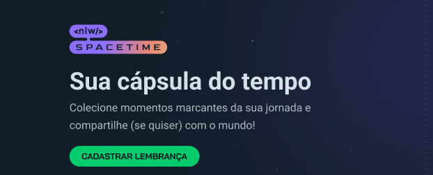

<h1 align="center"> SpaceTime - NLW#12 </h1>

  <a href="#-projeto">Projeto</a>&nbsp;&nbsp;&nbsp;|&nbsp;&nbsp;&nbsp;
  <a href="#-tecnologias">Tecnologias</a>&nbsp;&nbsp;&nbsp;|&nbsp;&nbsp;&nbsp;
  <a href="#-layout">Layout</a>&nbsp;&nbsp;&nbsp;|&nbsp;&nbsp;&nbsp;
  <a href="#memo-licença">Licença</a>

 

   

## 💻 Projeto
 
<h3>Boas-vindas ao projeto cápsula do tempo.</h3>
O <a>Spacetime</a> Aplicação de recordação de memórias, onde o usuário poderá adicionar à uma timeline textos, fotos e vídeos de acontecimentos marcantes da sua vida, organizados por mês e ano.

 
 

## 🚀 Tecnologias
 
Esse projeto foi desenvolvido com as seguintes tecnologias:

| Linguagem | Framework | Libs | Ferramentas | Banco de Dados |
| -------------------------------------------------------- | -------------------------------------------------------- | --------------------------------------------------- | ---------------------------------------------------------- | ------------------------------------------------------------- |
| JavaScript                                               | Node.js                                                  | Express                                             | ESLint                                                     | SQLite                                                        |
| TypeScript                                               | Next.js                                                  | Tailwind CSS                                        | Prettier                                                   | Prisma                                                        |
| HTML                                                     | Fastify                                                  | NativeWind                                          | NPM                                                        |                                                               |
| CSS                                                      | Expo                                                     |                                                     | NPX                                                        |                                                               |
|                                                          | React                                                    |                                                     | Git                                                        |                                                               |
|                                                          |                                                          |                                                     | GitHub                                                     |                                                               |
|                                                          |                                                          |                                                     | Visual Studio Code                                         |                                                               |

## 🔖 Layout

Você pode visualizar o layout do projeto através [DESSE LINK](https://www.figma.com/community/file/1240070456276424762). É necessário ter conta no [Figma](https://figma.com) para acessá-lo.

## Licença

  
 
 

